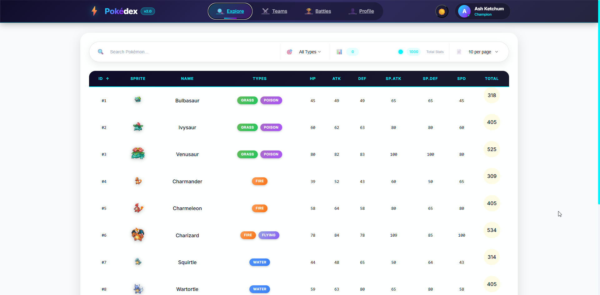
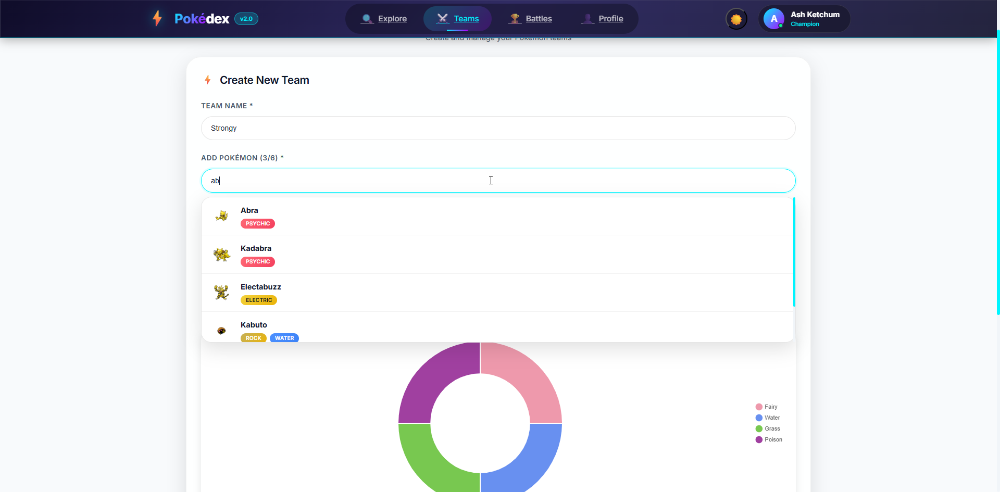
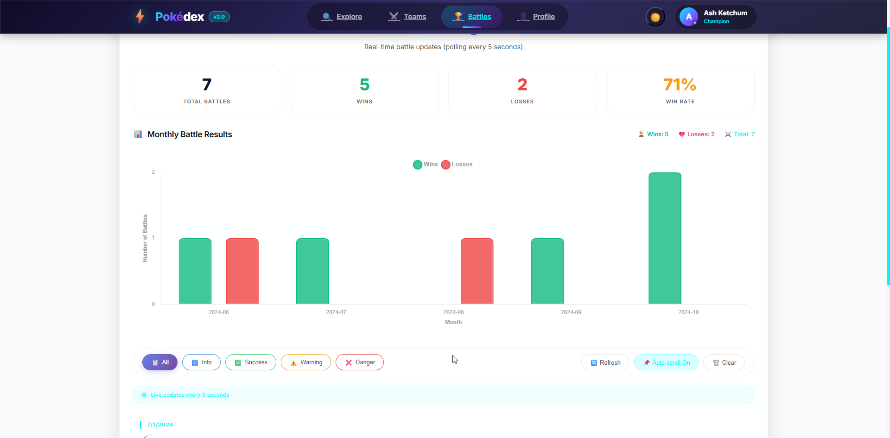
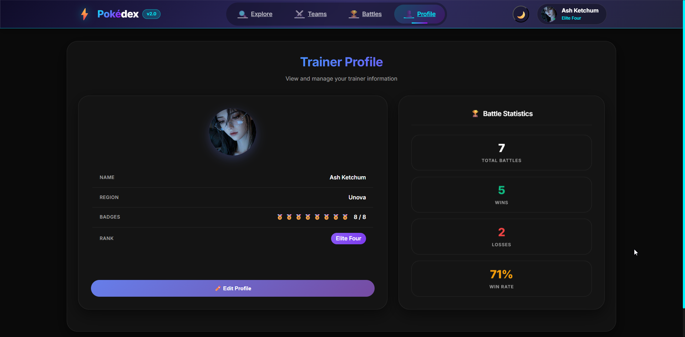
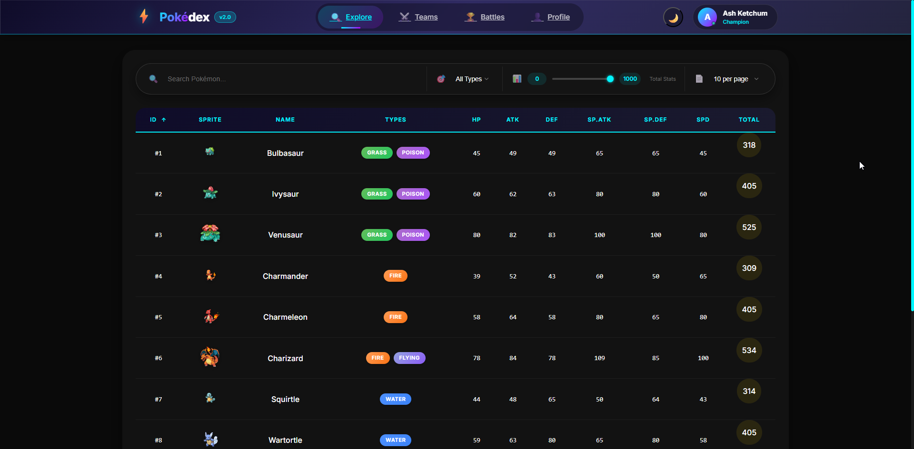

# 🐾 Pokédex Trainer Dashboard


> A modern Pokémon trainer dashboard built with Angular 19, featuring real-time battle updates, team management, and interactive charts.

## ✨ Features

- 📖 **Pokédex** - Browse 151 Pokémon with search, filter, sort, and pagination
- ⚡ **Team Builder** - Create and manage Pokémon teams with type coverage analysis
- 🏆 **Battle Log** - Real-time battle updates with 5-second polling
- 👤 **Trainer Profile** - Manage your profile and view battle statistics
- 📊 **Interactive Charts** - Radar charts, bar charts, and doughnut charts with animations
- 🌙 **Dark/Light Theme** - Toggle between themes with smooth transitions

## 📸 Screenshots

### Pokédex


*Pokémon list with type badges, stat columns, and pagination controls*

### Pokémon Detail Panel


*Detailed view with stats radar chart, Pokémon cry audio, and YouTube video*

### Team Builder


*Create teams with Pokémon search, type coverage analysis, and type distribution chart*

### Battle Log


*Real-time battle logs with severity filters and monthly battle results chart*

### Trainer Profile


*Trainer information with edit functionality and battle statistics*

### Dark Theme


*Modern dark theme with glass morphism effects*

## 🛠️ Tech Stack

- **Frontend**: Angular 19, TypeScript, RxJS
- **State Management**: BehaviorSubject + Signals
- **API**: GraphQL (PokeAPI), REST (JSON Server)
- **Charts**: Chart.js
- **Styling**: SCSS with CSS Variables
- **Testing**: Jasmine, Karma

## 📦 Installation

```bash
# Clone the repository
git clone https://github.com/modernWebDev9/pokemon.git

# Install dependencies
cd pokemon
npm install

# Start JSON Server (Terminal 1)
npm run start
# Start JSON Server (Terminal 2)
npx json-server db.json --port 4000
# Start JSON Server (Terminal 3)
npm run avatar-server